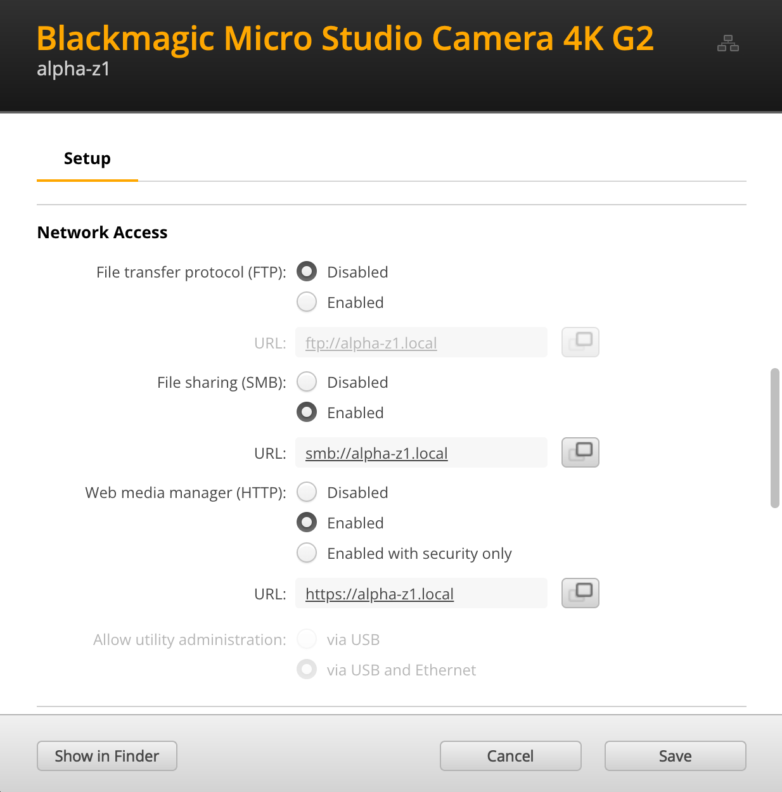

# PyBMCC

A Python library to monitor, command, and control network enabled Blackmagic Design Cameras.

## Supported Cameras
- Blackmagic Cinema Camera 6K
- Blackmagic URSA Broadcast G2
- Blackmagic Micro Studio Camera 4K G2
- Blackmagic Studio Camera 4K Plus
- Blackmagic Studio Camera 4K Pro
- Blackmagic Studio Camera 6K Pro
- Blackmagic Studio Camera 4K Plus G2
- Blackmagic Studio Camera 4K Pro G2

## Camera Setup

### Quick Setup
- Cameras must be reachable on the controller network
- Cameras must have a known IP or host name
- All cameras should have a unique name and IP address (if DHCP is not used)
- Web media mangager should be enabled
- SMB file sharing should be enabled
- HTTP should NOT be enabled with security

### Detailed Setup
1. Install Blackmagic Camera Setup (v8.4+) on a Windows or Mac computer: https://www.blackmagicdesign.com/support/family/professional-cameras
2. Power the camera and connect it via USB to the Mac or Windows computer
3. Open Blackmagic Camera Setup 
4. Connect to the camera, set the camera's name, click Set, then click Save.
5. 
5. If needed, Connect to the camera, set the camera's IP address, click Set, then click Save.

6. Enable the camera's HTTP and SMB network services, click Set, then click Save. Enabling utility administration from Ethernet is also reccomended.

7. Connect to the camera again and verify that all settings took. If not, reboot the camera and reset any settings that didn't take.
8. Disconnect the USB cable connected to the computer and connect the camera to the network using a USB adaptor if required.
9. Verify that the camera is configured correctly from Blackmagic Camera Setup
10. Open a web browser to http://CAMERA_NAME.local . A web page should appear. If this does not work, reverify the camera's network connectivity and settings.

## Installation
    pip install PyBMCC
    
## Features
- Built using Python 3, runs on Windows/Mac/Linux.
    - Tested on Linux/Windows PCs and Raspberry Pi.
- Full set of camera settings available (see list of ‘set’ methods).
- Automatic reconnection to the camera in case of connection loss.
- Camera settings automatically updated, there’s no need to call update() methods.
- Able to simultaneously connect to multiple cameras.
- Open source, you can see the code and customize it to fit your needs (see License)
- Minimal dependencies, requires six, urllib3, requests
- Desinged for multi-camera control

## Usage

    from PyBMCC import BMCCCamera
    from PyBMCC.Enums import CameraState
    import time
    
    camera = BMCCCamera("10.0.11.203")
    print(f"Camera is {camera.state.name}")
    camera.set_iris(aperture_stop=8.0)    #f8
    camera.set_zoom(focal_length=25)      #25mm
    camera.set_shutter(shutter_angle=180) #180° Shutter
    camera.do_auto_focus()
    time.sleep(1.0) # Wait for the lens
    camera.record_start()
    time.sleep(3.0) # 3 second clip
    camera.record_stop()
    print(camera.get_last_clip_url())    # direct http download link to the last clip recorded

## Limitations
- Async API is not yet implemented, support is planned in the near future
- HTTPS, authtentication, and custom certificates are currently not supported, support in planned in the near future
- Preset Controls are mostly broken. This will be addressed when Blackmagic Design provides a patch or workaround
- Any API call that returns a dict is at risk of being updated in a future version
- Only 1 disk is supported in BMCCCamera functions

## Blackmagic Camera REST API Swagger Erreta

This section documents erreta in version 0.1.0 of the Blackmagic REST API

**AudioControl:**

- All methods are missing an OpenAPI operationId
- /audio/channel/{channelIndex}/input/description GET: description.capabilities is returned as an array. This is not in the API spec.
- /audio/channel/{channelIndex}/supportedInputs GET: data is returned as an array, not as a channelIndex object as specified.
- /audio/channel/{channelIndex}/phantomPower GET: object key returned is "enabled", not "phantom_power". This is not in the API spec.
- /audio/channel/{channelIndex}/phantomPower SET: status code 204 is always returned with any input when not supported. API spec says this should return 400 or 404.
- /audio/channel/{channelIndex}/padding GET: object key returned is "enabled", not "padding". This is not in the API spec.
- /audio/channel/{channelIndex}/padding SET: status code 204 is always returned with any input when not supported. API spec says this should return 400 or 404.
- /audio/channel/{channelIndex}/lowCutFilter GET: object key returned is "enabled", not "lowCutFilter". This is not in the API spec.
- /audio/channel/{channelIndex}/lowCutFilter SET: status code 204 is always returned with any input when not supported. API spec says this should return 400 or 404.

- **MediaControl:**

- All methods are missing an OpenAPI operationId

**TimelineControl**

- All methods are missing an OpenAPI operationId

**ColorCorrection**

- All methods are missing an OpenAPI operationId

**TransportControl**

- All methods are missing an OpenAPI operationId
- /transports/0/timecode/source GET: 'source' parameter is used, not 'timecode'

**EventControl**

- All methods are missing an OpenAPI operationId
- /event/list GET: an array of values is returned, not a property with an array as specified

**PresetControl**

- All methods are missing an OpenAPI operationId

**VideoControl**

- All methods are missing an OpenAPI operationId

**LensControl**

- All methods are missing an OpenAPI operationId
- /lens/focus PUT,GET: 'normalized' parameter is used, not 'focus'

**SystemControl**

- All methods are missing an OpenAPI operationId
- /system GET: status 204 is returned with no data which is not defined in the API specification
- $ref: "#/components/schemas/FrameRate" has sibling properties which are ignored by the OpenAPI specification

**CameraControl**

- API is not documented due to a missing schema
- /camera/id GET: returns ATEM_ID, a number between 1-254 (typically 1-100)
- /camera/id PUT: sets ATEM_ID, a number between 1-254 (typically 1-100)

**ClipsControl**

- API is not documented due to a missing schema
- /clips/list GET: returns the list of clips on the camera
